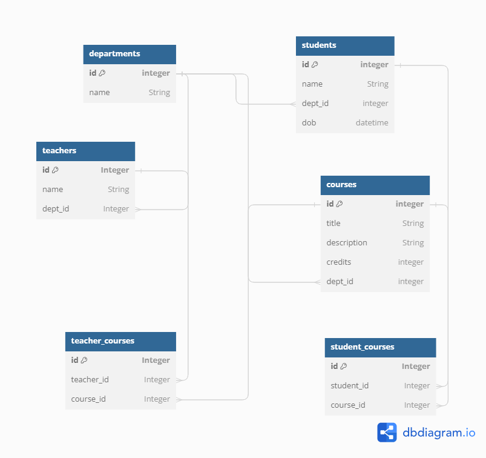

# Sila coding assignment

## Project Overview

This project utilizes technologies such as FastAPI for building APIs, SQLAlchemy for ORM, and MySQL for the database.

## Database Schema Diagram



You can also view the diagram interactively [here](https://dbdiagram.io/d/sila-assignment-65be56e1ac844320ae5ec91d).

## Technologies Used

- FastAPI
- SQLAlchemy
- MySQL
- Pydantic
- Uvicorn

## Running the Project

To run this project, follow these steps:

1. Clone the repository to your local machine:

   ```sh
   git clone https://your_repository_url_here.git
   ```

2. Navigate to the project directory:

   ```sh
   cd your_project_directory
   ```

3. Install the required dependencies (Optional: may be required for your local interpretor to install the dependencies in a virtual environment):

   ```sh
   pip install -r requirements.txt
   ```

4. Build and run the docker container using the following command:

   ```sh
    docker-compose up --build
   ```

   The `--reload` flag enables auto-reloading of the server on code changes.

5. Access the API docs on swagger at `http://127.0.0.1:8000/docs`.

### Note

As initially the database may not contain any data therefore run "seed-data" endpoint to populate the database with some initial data.
